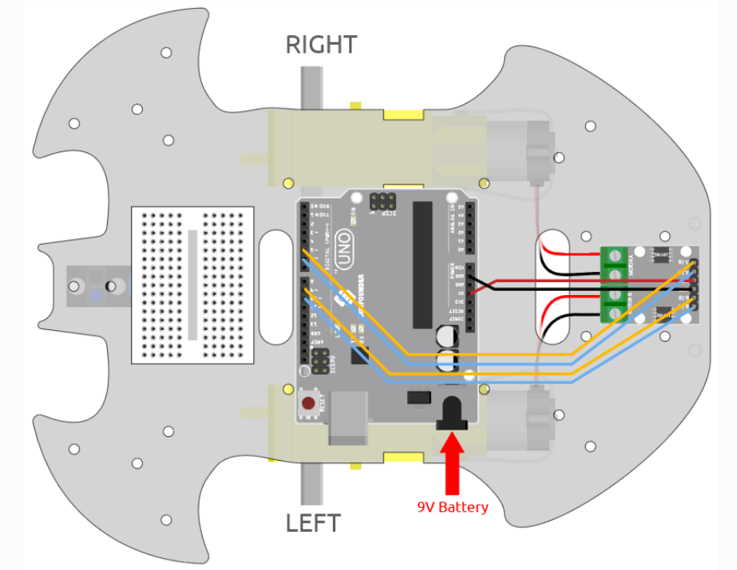
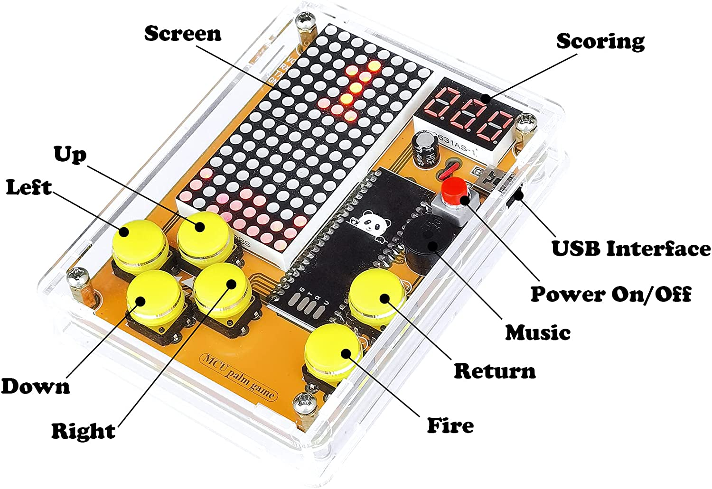

# Self Driving Car - 227
Replace this text with a brief description (2-3 sentences) of your project. This description should draw the reader in and make them interested in what you've built. You can include what the biggest challenges, takeaways, and triumphs from completing the project were. As you complete your portfolio, remember your audience is less familiar than you are with all that your project entails!`

You should comment out all portions of your portfolio that you have not completed yet, as well as any instructions:
```HTML 
<!--- This is an HTML comment in Markdown -->
<!--- Anything between these symbols will not render on the published site -->
```

| **Engineer** | **School** | **Area of Interest** | **Grade** |
|:--:|:--:|:--:|:--:|
| Victor J | Stratford Preparatory Blackford | Robotics | Incoming Sophomore

**Replace the BlueStamp logo below with an image of yourself and your completed project. Follow the guide [here](https://tomcam.github.io/least-github-pages/adding-images-github-pages-site.html) if you need help.**


  
# Final Milestone

**Don't forget to replace the text below with the embedding for your milestone video. Go to Youtube, click Share -> Embed, and copy and paste the code to replace what's below.**

<iframe width="560" height="315" src="https://www.youtube.com/embed/F7M7imOVGug" title="YouTube video player" frameborder="0" allow="accelerometer; autoplay; clipboard-write; encrypted-media; gyroscope; picture-in-picture; web-share" allowfullscreen></iframe>

For your final milestone, explain the outcome of your project. Key details to include are:
- What you've accomplished since your previous milestone
- What your biggest challenges and triumphs were at BSE
- A summary of key topics you learned about
- What you hope to learn in the future after everything you've learned at BSE


# Second Milestone

**Don't forget to replace the text below with the embedding for your milestone video. Go to Youtube, click Share -> Embed, and copy and paste the code to replace what's below.**

<iframe width="560" height="315" src="https://www.youtube.com/embed/y3VAmNlER5Y" title="YouTube video player" frameborder="0" allow="accelerometer; autoplay; clipboard-write; encrypted-media; gyroscope; picture-in-picture; web-share" allowfullscreen></iframe>

For your second milestone, explain what you've worked on since your previous milestone. You can highlight:
- Technical details of what you've accomplished and how they contribute to the final goal
- What has been surprising about the project so far
- Previous challenges you faced that you overcame
- What needs to be completed before your final milestone 

# First Milestone
<iframe width="560" height="315" src="https://www.youtube.com/embed/GWJhXuCSVXM?si=3m_VEQC6RZUU1Vw6" title="YouTube video player" frameborder="0" allow="accelerometer; autoplay; clipboard-write; encrypted-media; gyroscope; picture-in-picture; web-share" referrerpolicy="strict-origin-when-cross-origin" allowfullscreen></iframe>

## Summary
For this milestone, I completed all aspects of the chassis/physical body of the self-driving car besides some wiring. The entire building process took around 2 hours, and was finished in one day. I also implemented the code allowing the car to move upon the upload of preset actions (ex. move fowards, turn, then move forwards again). It could move in all directions and turn, as well as accelerate and deccelerate. The original wiring allowed the car to act without any code, but was undone to advance to code-based movements. A 9V battery powers an Arduino Uno, which is connected to a L9110 module controlling 2 TT motors. The wires from the motors are inserted into the green terminals of the module, and 2 wires that extend from the pins connect the module to both the Arduino and bread board. A wire running from the 5V header in the Arduino provides power to the bread board, allowing the L9110 module and other components to recieve power. 



Figure x: A diagram of the wiring done to allow the robot to move off of preset instructions.   

## Challenges
I didn't run into many difficulties during this milestone. The assembly of the robot went along smoothly, but the robot wouldn't move. I originally thought it was a wiring problem, but after rewiring the robot still didn't move. I then noticed that the Arduino itself wasn't recieving power, so I swapped out the battery, which didn't resolve the issue. The problem was with the adapter, and after replacing it the car functioned properly. The process of coding the functions went smoothly, with a few wiring issues that were easily fixed (I put the wires in the wrong headers). 

## Next Steps
For my next steps, I will continue to develop the functions of the robot and incorporate both the object avoidance and the ultrasonic sensor.   

**Don't forget to replace the text below with the embedding for your milestone video. Go to Youtube, click Share -> Embed, and copy and paste the code to replace what's below.**

<iframe width="560" height="315" src="https://www.youtube.com/embed/CaCazFBhYKs" title="YouTube video player" frameborder="0" allow="accelerometer; autoplay; clipboard-write; encrypted-media; gyroscope; picture-in-picture; web-share" allowfullscreen></iframe>

# Schematics 
Here's where you'll put images of your schematics. [Tinkercad](https://www.tinkercad.com/blog/official-guide-to-tinkercad-circuits) and [Fritzing](https://fritzing.org/learning/) are both great resoruces to create professional schematic diagrams, though BSE recommends Tinkercad becuase it can be done easily and for free in the browser. 

# Code
Here's where you'll put your code. The syntax below places it into a block of code. Follow the guide [here]([url](https://www.markdownguide.org/extended-syntax/)) to learn how to customize it to your project needs. 

```c++
void setup() {
  // put your setup code here, to run once:
  Serial.begin(9600);
  Serial.println("Hello World!");
}

void loop() {
  // put your main code here, to run repeatedly:

}
```

# Bill of Materials
<!---Here's where you'll list the parts in your project. To add more rows, just copy and paste the example rows below.
Don't forget to place the link of where to buy each component inside the quotation marks in the corresponding row after href =. Follow the guide [here]([url](https://www.markdownguide.org/extended-syntax/)) to learn how to customize this to your project needs. -->

| **Part** | **Note** | **Price** | **Link** |
|:--:|:--:|:--:|:--:|
| Kit | A kit containing all the componenets required for the project | $59.99 | <a href="https://www.amazon.com/dp/B0B778L1DZ?&linkCode=sl1&tag=sunfounder03-20&linkId=6e7fba81fb2756b979943c012bd5534f&language=en_US&ref_=as_li_ss_tl"> Link </a> |

# Other Resources/Examples
One of the best parts about Github is that you can view how other people set up their own work. Here are some past BSE portfolios that are awesome examples. You can view how they set up their portfolio, and you can view their index.md files to understand how they implemented different portfolio components.
- [Example 1](https://trashytuber.github.io/YimingJiaBlueStamp/)
- [Example 2](https://sviatil0.github.io/Sviatoslav_BSE/)
- [Example 3](https://arneshkumar.github.io/arneshbluestamp/)

To watch the BSE tutorial on how to create a portfolio, click here.

# Starter Project: Retro Arcade Console - 005
<iframe width="560" height="315" src="https://www.youtube.com/embed/YPPs7FFykw0?si=X7m8YlcUn64qInDU" title="YouTube video player" frameborder="0" allow="accelerometer; autoplay; clipboard-write; encrypted-media; gyroscope; picture-in-picture; web-share" referrerpolicy="strict-origin-when-cross-origin" allowfullscreen></iframe>

[Link to the Starter Project](https://www.amazon.com/Electronic-Soldering-Practice-Comfortable-VOGURTIME/dp/B094QRRHC2/ref=sr_1_3?crid=12C0SOV36FG6M&dib=eyJ2IjoiMSJ9.Prj06eg0mzBHrfW8zuFr43Ott4t2wUOVBo8A8bYw0PqFZRlOEmgR5YwhMy7jXrdI2HlBjVttnEyYLz5CP684SzJyHmVMBp25vNna9o8wjV-df55ilTgj0xMy1CiRwkcnu6xqacZ3JUPlq8C3mQJwmEtoeokndNqpwpdkZBQMplM9vg3M-cfB0xM_nXdjeqHQ3bB707ehrzX6Llp-Euu3CTFzF8wgEqhPwo6RCvzbo5M.yyrFg8EXJr9BL5cOgZF551-8cIl91p0MSy8nGiilcpU&dib_tag=se&keywords=arcade%2Bsolder%2Bproject&qid=1717994267&sprefix=arcade%2Bsolder%2Bprojec%2Caps%2C147&sr=8-3&th=1)

## Summary
I enjoy playing arcade games, so I thought it would be nice to have a portable one of my own. With this console, I am able to swap between 4 different games to play using the left and right arrows, interact with/play the game with the up and down arrows, start games with the green button and end games with the yellow button. It can powered by getting plugged into a computer via a USB cord or through batteries. The game is displayed through 2 dot matrices that flash individual lights to form patterns for a game. 


Figure x: A picture showing the retro arcade console with labeled components. 

## Components Used
 - Buzzer
 - Electric Capacitor
 - Micro USB
 - Power Cable
 - Self-Switch
 - Self-Switch Cap
 - Digitron Display
 - IC Chip
 - LED Dot Matrix Module
 - Button
 - Button Cap
 - PCB
 - 3x5mm Screw
 - 3x8mm Screw
 - 3x9mm Copper Column
 - 5+6mm Hexagonal Column
 - Battery Case
 - Acrylic Shell

## Challenges
I learned soldering the same day I completed the starter project, so it took a while to get used to (almost the whole project was soldering). I burned myself on accident, but got the hang of it by time I finished the starter. 

## Next Step
For my next step, I'll start the process of building the chassis of the self driving car. 
