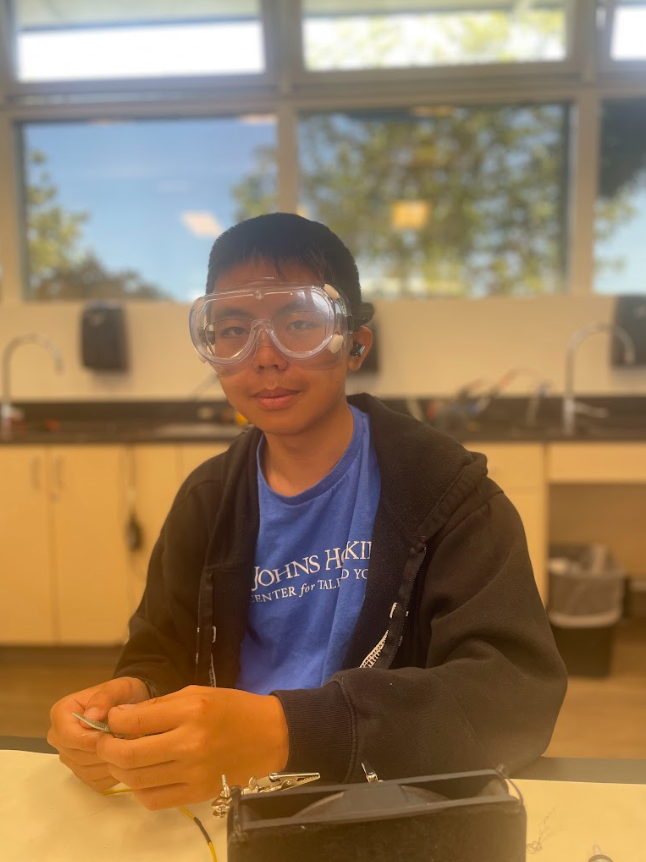
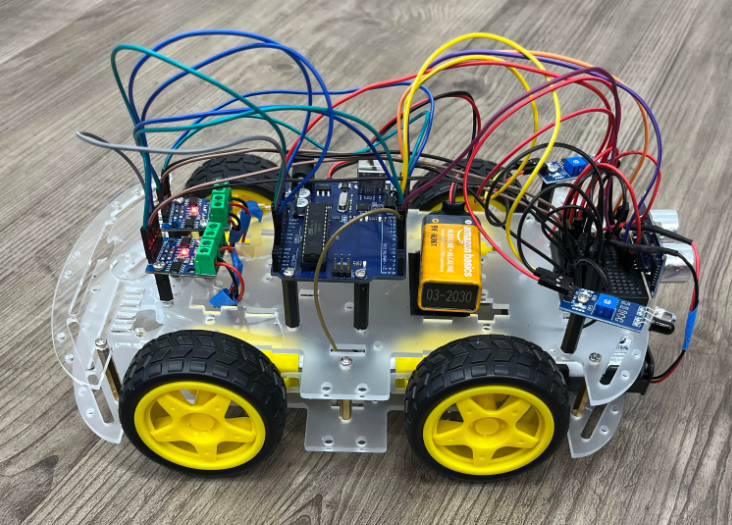
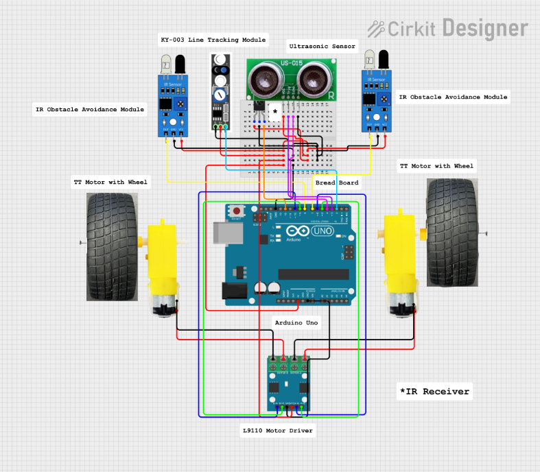
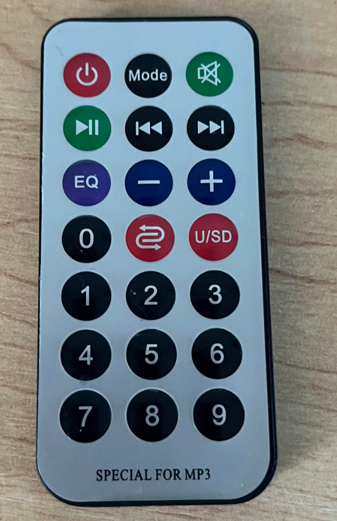
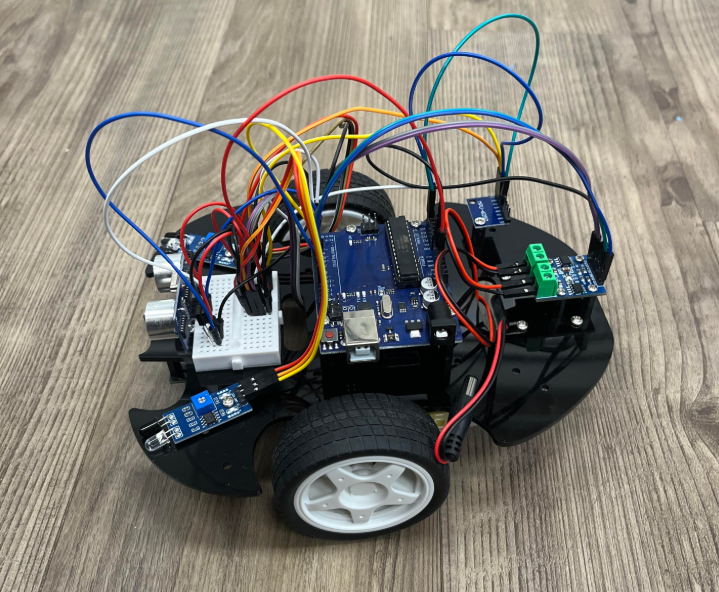
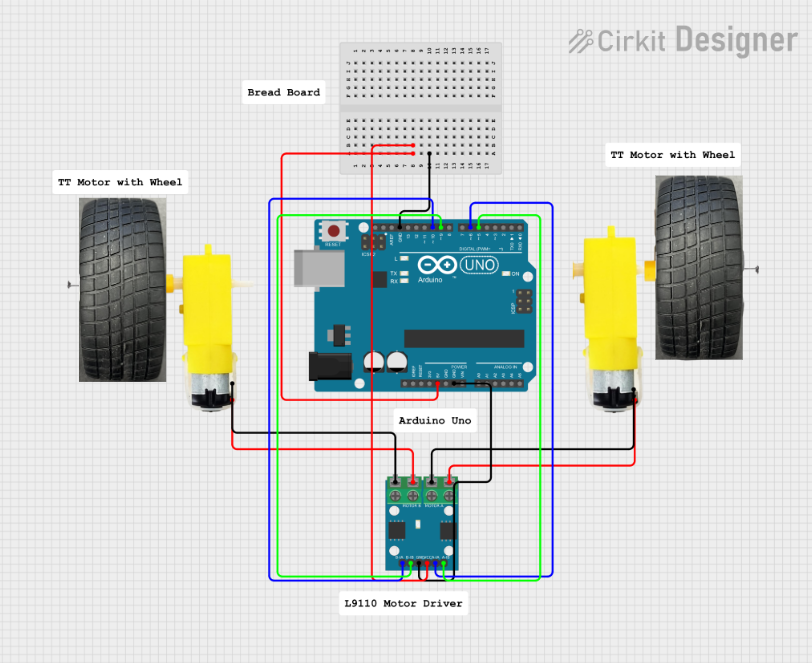
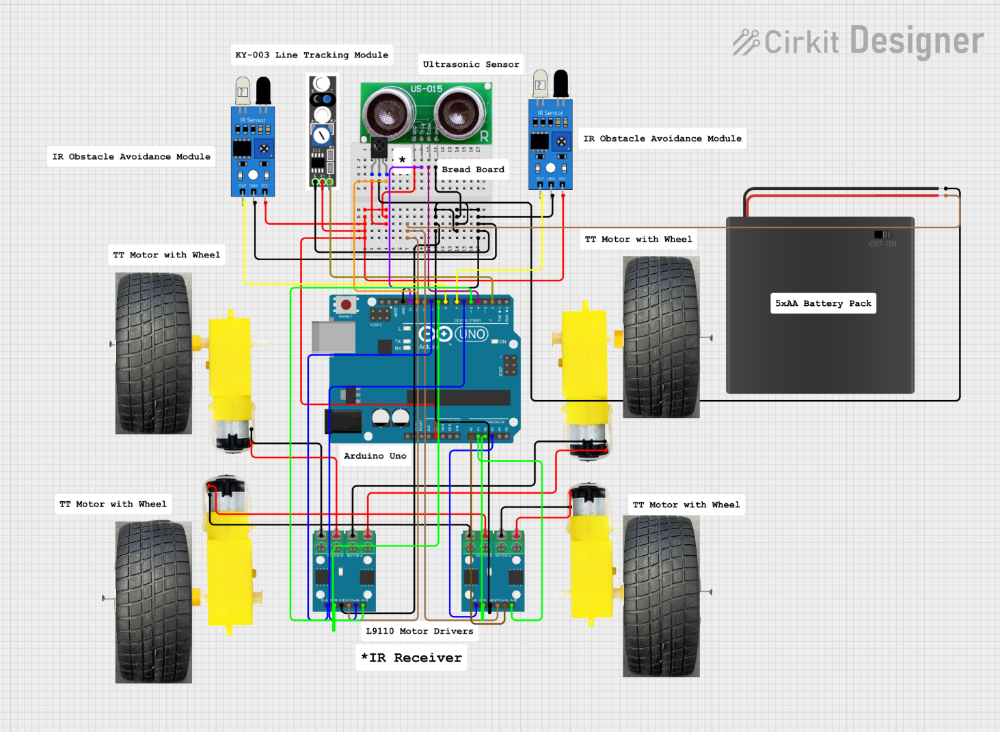
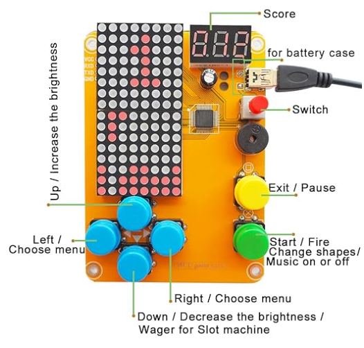

# Self Driving Car - 227
<!--Replace this text with a brief description (2-3 sentences) of your project. This description should draw the reader in and make them interested in what you've built. You can include what the biggest challenges, takeaways, and triumphs from completing the project were. As you complete your portfolio, remember your audience is less familiar than you are with all that your project entails!`-->
Self-piloting cars are the future of transportation, and are already being implemented by companies such as Waymo. They have the potential to greatly reduce the chances of a car accident, and can provide safe rides for everyone. For my project, I built a miniaturized version of the self-driving car that can operate with human control by detecting obstacles and changing their path accordingly. It can also be controlled through an IR remote, which is encoded with multiple functions ranging from basic movement to hand-following and full autonomous mode. 
<!--You should comment out all portions of your portfolio that you have not completed yet, as well as any instructions:
```HTML -->
<!--- This is an HTML comment in Markdown -->
<!--- Anything between these symbols will not render on the published site -->


| **Engineer** | **School** | **Area of Interest** | **Grade** |
|:--:|:--:|:--:|:--:|
| Victor J | Stratford Preparatory Blackford | Robotics | Incoming Sophomore |

<!--**Replace the BlueStamp logo below with an image of yourself and your completed project. Follow the guide [here](https://tomcam.github.io/least-github-pages/adding-images-github-pages-site.html) if you need help.**-->


  
# Final Milestone
<iframe width="560" height="315" src="https://www.youtube.com/embed/7szSlxqjNI4?si=QJAD192xvliJND-U" title="YouTube video player" frameborder="0" allow="accelerometer; autoplay; clipboard-write; encrypted-media; gyroscope; picture-in-picture; web-share" referrerpolicy="strict-origin-when-cross-origin" allowfullscreen></iframe>

## Summary
For my final milestone, I transferred all components of the robot from a two wheel base to a 4 wheel drive chassis. This solves the previous problem of the robot not driving straight: with only 2 wheels it is easy to notice the different in motor speeds, but with 4 the difference is negligible. In addition, with 4 wheels, the robot now goes much faster than before. 

## Technical Breakdown
The layout of the wires and components is similar to that of the 2 wheel drive base. The main difference is that there are now 4 TT motors and 2 L9110 motor drivers, with each driver controlling two motors. The 9V battery that used to power both the Arduino and motor driver no longer provides enough charge to power 2 motor drivers, so they are now powered using a 5 pack of 1.5V AA batteries. 



Figure 1: A picture of the final body of the car. 

## Challenges
This was the most difficult milestone by far. When I first built the 4 wheel drive chassis, I had one L298N motor driver controlling all 4 motors. This was not a good decision, as the driver did not function properly and was overworked from being attached to 4 motors. I replaced it 2 L9110 motor drivers, which solved that problem but caused many other issues. When I tried to manually move the robot through preset instructions, the front right wheel would perform properly when told to move forwards but would freeze when told to move backwards. I tried multiple hardware fixes, including replacing the motor driver, replacing the motor, replacing the battery, and even rewiring the driver to different slots on the Arduino. When none of these resolved the issue, I realized it was a software problem. I checked my code, and found that I had a typo in my setup function that stopped the motor from turning backwards. 

Another problem I had was with the IR remote. Although the button presses were registering and the signal was being transmitted to the Arduino, there was no movement in the motors. I printed out the decoded signal, and found out that it was returning 0 (or error) for each button press after the first one. The program works by comparing the raw signal received to a list of signals, matching it, and then telling the car to move accordingly. That means that although the signal was being sent to the Arduino, it was not getting matched up with an action. I created another sketch that returned the raw value of the signal, and fixed my original code by replacing the values the signals were being compared to with the values that I got from the other sketch. The signals were now being properly matched, and the problem was fixed. 

## What I Learned
Over the course of the camp, I gained a lot of knowledge and learned many important lessons. First, I learned about electrical engineering, including the basics of soldering and how components such as resistors work. I used that information to successfully complete my starter project. Second, I also learned how to program Arduinos and its components. This was the basis of my actual project, as I had to implement and code multiple different parts to end up with a functioning robot. Lastly and most importantly, I learned valuable lessons on problem solving through debugging issues with my car. I learned that you should always check for basic mistakes after spending 4 hours trying to fix an error caused by a typo, and that getting frustrated does not do anything to help you fix your problems. 

<!-- For your final milestone, explain the outcome of your project. Key details to include are:
- What you've accomplished since your previous milestone
- What your biggest challenges and triumphs were at BSE
- A summary of key topics you learned about
- What you hope to learn in the future after everything you've learned at BSE -->

# Second Milestone
<iframe width="560" height="315" src="https://www.youtube.com/embed/cNyybMMJYjY?si=IBDuVa3nuL4FwkQV" title="YouTube video player" frameborder="0" allow="accelerometer; autoplay; clipboard-write; encrypted-media; gyroscope; picture-in-picture; web-share" referrerpolicy="strict-origin-when-cross-origin" allowfullscreen></iframe>

## Summary
For this milestone, I implemented multiple different functions of the robot car. It is now able to follow a black line on the ground using the line tracking module. The car can also use the obstacle avoidance modules to follow my hand. By working with the ultrasonic sensor to detect and avoid objects, the modules also allow the robot to operate fully autonomously. Lastly, the robot's movements can now be controlled through button presses on an IR remote. 

## Technical Breakdown
The line tracking module detects the color of the floor underneath the robot, and returns a number based on the color (0 for white, 1 for black). If 1 is returned, the robot turns forwards right. If 0 is returned, the robot turns forwards left. The end result is the car will zigzag along and follow the line. 

The car can also detect distance and avoid obstacles using the obstacle avoidance modules and ultrasonic sensor. The obstacle avoidance modules send a signal if they detect objects ahead, and the range of detection can be changed by rotating a potentiometer on the module. Using the signal, you can code the robot to turn away from the obstacle or completely stop. However, due to the short detection range on the obstacle avoidance modules, they often do not send the signal to the Arduino in time to avoid the obstacle. The ultrasnoic sensor has a much longer range, and can therefore be more effective for avoiding obstacles. The sensor sends ultrasonic waves ahead, and records how long it takes for the waves to rebound off an object in order to calculate the distance between the sensor and that object. Using these tools, the robot is able to go fully autonomous (self-piloting); when it detects an object, it turns and goes in a different direction. 

A different function that utilizes the obstacle avoidance module is hand-following. The modules, upon detection of an object, turn and go towards it instead of away, allowing the car to follow the movements of my hand. 

The most important part of this milestone was the IR remote controller. It sends a signal to an IR reciever on the bread board of the car, which then transmits a signal to the Arduino, allowing it to perform a task based on the button pressed. The remote is encoded with basic movements (move forwards, move backwards, brake, turn left, turn right, etc) along with the previously mentioned functions (autonomous, line and hand following, etc). 



Figure 2: The final wiring diagram of the two wheel drive robot implementing all components. Red wires are 5V or VCC (power), and black wires are GND (ground). The dark blue and green wires connect the motor driver to the Arduino. The yellow wires connect the obstacle avoidance modules to the Arduino. The pink and purple wires connect the ultrasonic sensor to the Arduino. The orange wire connects the IR sensor to the Arduino. The light blue wire connects the line tracking module to the Arduino. 



Figure 3: The remote controller used to control the movements of the car. 

+, -: increase and decrease speed

1, 3: turn forwards left and forwards right

2: go forwards

4, 6: spin left and right in place

5: brake

7, 9: turn backwards left and backwards right

8: go backwards

Twisted arrows: line following mode

U/SD: autonomous mode

EQ: hand following mode



Figure 4: The robot at the time of the second milestone

## Challenges
There was a major problem with the motor driver. The motor connected to the green terminals on the right malfunctioned: it was significantly slower than the left one, and often randomly stopped working. I originally thought it might have been a problem with the motor, so I replaced it. However, when that the problem still remained unfixed, I then swapped the left and right motors. I discovered that the motor connected to the right green terminals would not properly spin, and resolved it after replacing the motor driver. 

## Next Steps
The robot does not go fully straight forwards as of now: it slightly curves to the left. I will be fixing this issue for my next step, as well as start implementing my modifications. 

<!--For your second milestone, explain what you've worked on since your previous milestone. You can highlight:
- Technical details of what you've accomplished and how they contribute to the final goal
- What has been surprising about the project so far
- Previous challenges you faced that you overcame
- What needs to be completed before your final milestone -->

# First Milestone
<iframe width="560" height="315" src="https://www.youtube.com/embed/GWJhXuCSVXM?si=3m_VEQC6RZUU1Vw6" title="YouTube video player" frameborder="0" allow="accelerometer; autoplay; clipboard-write; encrypted-media; gyroscope; picture-in-picture; web-share" referrerpolicy="strict-origin-when-cross-origin" allowfullscreen></iframe>

## Summary
For this milestone, I completed all aspects of the physical body of the self-driving car. The entire building process took around two hours, and was finished in one day. I also implemented the code allowing the car to move through set instructions. It can move in all directions and turn, as well as accelerate and deccelerate. 

## Technical Breakdown
A 9V battery acts as the power source of the car, and is plugged into the Arduino Uno. The Arduino is the "brain" of the car, where code is uploaded. The L9110 motor driver connects the Arduino to two TT motors that move the wheels of the car. The motor driver helps the Arduino precisely control the actions of those motors. Lastly, both the Arduino and the motor driver are connected to the bread board, which acts as a hub for all connecting wires and delivers power to the robots components. 



Figure 5: A diagram of the wiring done to allow the robot to move off of preset instructions. Red wires are 5V or VCC (power), and black wires are GND (ground). The blue and green wires connect the motor drive to the Arduino. 

## Challenges
The assembly of the robot car went along smoothly, but the robot would not move. I originally thought it was a wiring problem, but after redoing the wiring it still would not move. I then noticed that the Arduino itself was not recieving power, so I swapped out the battery. When that still did not resolve the issue, I discovered that the problem was with the adapter. After replacing it the car functioned properly. 

## Next Steps
For my next steps, I will continue to develop the functions of the robot and incorporate both the object avoidance and the ultrasonic sensor.   

<!--**Don't forget to replace the text below with the embedding for your milestone video. Go to Youtube, click Share -> Embed, and copy and paste the code to replace what's below.**-->

# Schematics 
<!--Here's where you'll put images of your schematics. [Tinkercad](https://www.tinkercad.com/blog/official-guide-to-tinkercad-circuits) and [Fritzing](https://fritzing.org/learning/) are both great resoruces to create professional schematic diagrams, though BSE recommends Tinkercad becuase it can be done easily and for free in the browser.-->


Figure 6: 
This is the final wiring of the 4 wheel drive robot. Red wires are 5V or VCC (power), and black wires are GND (ground). The dark blue and green wires connect the motor drivers to the Arduino. The yellow wires connect the obstacle avoidance modules to the Arduino. The pink and purple wires connect the ultrasonic sensor to the Arduino. The orange wire connects the IR sensor to the Arduino. The gold wire connects the line tracking module to the Arduino. The brown wires connect the motor drivers to the 5xAA battery pack. 


# Code
<!--Here's where you'll put your code. The syntax below places it into a block of code. Follow the guide [here]([url](https://www.markdownguide.org/extended-syntax/)) to learn how to customize it to your project needs. -->
Final rendition of the code pushed onto the robot that allows me to control it with IR remote button presses
```c++
#include <IRremote.h>

const int IR_RECEIVE_PIN = 12;

const int fB_1A = 10;
const int fB_1B = 9;
const int fA_1A = 6;
const int fA_1B = 5;

const int bB_1A = A3;
const int bB_1B = A2;
const int bA_1A = A0;
const int bA_1B = A1;

const int echoPin = 4;
const int trigPin = 13;

const int rightIR = 7;
const int leftIR = 8;

const int lineTrackPin = 2;

int speed = 150;
String flag = "NONE";

unsigned long lastRawValue = 0;

void setup() {
  Serial.begin(9600);

  //motor
  pinMode(fB_1A, OUTPUT);
  pinMode(fB_1B, OUTPUT);
  pinMode(fA_1A, OUTPUT);
  pinMode(fA_1B, OUTPUT);
  pinMode(bB_1A, OUTPUT);
  pinMode(bB_1B, OUTPUT);
  pinMode(bA_1A, OUTPUT);
  pinMode(bA_1B, OUTPUT);

  //ultrasonic
  pinMode(echoPin, INPUT);
  pinMode(trigPin, OUTPUT);

  //IR obstacle
  pinMode(leftIR, INPUT);
  pinMode(rightIR, INPUT);

  //Line Track Module
  pinMode(lineTrackPin, INPUT);

  //IR remote
  IrReceiver.begin(IR_RECEIVE_PIN);
  Serial.println("REMOTE CONTROL START");

}

 void loop() {
  if (IrReceiver.decode()) {
    unsigned long rawValue;
    if (IrReceiver.decodedIRData.flags & IRDATA_FLAGS_IS_REPEAT) {
      rawValue = lastRawValue;
    } else {
      rawValue = IrReceiver.decodedIRData.decodedRawData;
      lastRawValue = rawValue;
    }

    String key = decodeRawValue(rawValue);
    if (key != "ERROR") {
      if (key == "+") {
        speed += 50;
        Serial.println(speed);
      } else if (key == "-") {
        speed -= 50;
        Serial.println(speed);
      } else if (key == "2") {
        moveForward(speed);
        delay(1000);
      } else if (key == "1") {
        moveLeft(speed);
      } else if (key == "3") {
        moveRight(speed);
      } else if (key == "4") {
        turnLeft(speed);
      } else if (key == "6") {
        turnRight(speed);
      } else if (key == "7") {
        backLeft(speed);
      } else if (key == "9") {
        backRight(speed);
      } else if (key == "8") {
        moveBackward(speed);
        delay(1000);
      } else if (key == "CYCLE") {
        flag = "LINE";
      } else if (key == "U/SD") {
        flag = "AUTO";
      } else if (key == "0") {
        flag = "NONE";
        stopMove();
      } else if (key == "FORWARD") {
        flag = "ULTR";
      } else if (key == "BACKWARD") {
        flag = "IROB";
      } else if (key == "EQ") {
        flag = "FOLW";
      }

      if (speed > 255) speed = 255;
      if (speed < 0) speed = 0;

      delay(500);
      stopMove();
    }
  IrReceiver.resume();
  }
}


String decodeRawValue(unsigned long rawValue) {
  switch(rawValue) {
    case 0xE916FF00:
      return "0";
    case 0xF30CFF00:
      return "1"; 
    case 0xE718FF00:
      return "2"; 
    case 0xA15EFF00:
      return "3"; 
    case 0xF708FF00:
      return "4"; 
    case 0xE31CFF00:
      return "5"; 
    case 0xA55AFF00:
      return "6"; 
    case 0xBD42FF00:
      return "7"; 
    case 0xAD52FF00:
      return "8"; 
    case 0xB54AFF00:
      return "9"; 
    case 0xF609FF00:
      return "+"; 
    case 0xEA15FF00:
      return "-"; 
    case 0xF807FF00:
      return "EQ"; 
    case 0xF20DFF00:
      return "U/SD";
    case 0xE619FF00:
      return "CYCLE";         
    case 0xBB44FF00:
      return "PLAY/PAUSE";   
    case 0xBC43FF00:
      return "FORWARD";   
    case 0xBF40FF00:
      return "BACKWARD";   
    case 0xBA45FF00:
      return "POWER";   
    case 0x47:
      return "0xB847FF00";   
    case 0xB946FF00:
      return "MODE";       
    case 0x0:
      return "ERROR";   
    default :
      return "ERROR";
  }
}


float readSensorData() {
  digitalWrite(trigPin, LOW);
  delayMicroseconds(2);
  digitalWrite(trigPin, HIGH);
  delayMicroseconds(10);
  digitalWrite(trigPin, LOW);
  float distance = pulseIn(echoPin, HIGH) / 58.00;  //Equivalent to (340m/s*1us)/2
  return distance;
}

void moveForward(int speed) {
  Serial.println("moveForward() triggered");
  Serial.print("Speed: ");
  Serial.println(speed);

  analogWrite(fA_1B, speed);
  analogWrite(fA_1A, 0);
  analogWrite(fB_1B, 0);
  analogWrite(fB_1A, speed);
  analogWrite(bA_1B, speed);
  analogWrite(bA_1A, 0);
  analogWrite(bB_1B, 0);
  analogWrite(bB_1A, speed);
}

void moveBackward(int speed) {
  analogWrite(fA_1B, 0);
  analogWrite(fA_1A, speed);
  analogWrite(fB_1B, speed);
  analogWrite(fB_1A, 0);
  analogWrite(bA_1B, 0);
  analogWrite(bA_1A, speed);
  analogWrite(bB_1B, speed);
  analogWrite(bB_1A, 0);
}

void turnRight(int speed) {
  analogWrite(fA_1B, 0);
  analogWrite(fA_1A, speed);
  analogWrite(fB_1B, 0);
  analogWrite(fB_1A, speed);
  analogWrite(bA_1B, 0);
  analogWrite(bA_1A, speed);
  analogWrite(bB_1B, 0);
  analogWrite(bB_1A, speed);
}

void turnLeft(int speed) {
  analogWrite(fA_1B, speed);
  analogWrite(fA_1A, 0);
  analogWrite(fB_1B, speed);
  analogWrite(fB_1A, 0);
  analogWrite(bA_1B, speed);
  analogWrite(bA_1A, 0);
  analogWrite(bB_1B, speed);
  analogWrite(bB_1A, 0);
}

void moveLeft(int speed) {
  analogWrite(fA_1B, speed);
  analogWrite(fA_1A, 0);
  analogWrite(fB_1B, 0);
  analogWrite(fB_1A, 75);
  analogWrite(bA_1B, speed);
  analogWrite(bA_1A, 0);
  analogWrite(bB_1B, speed);
  analogWrite(bB_1A, 0);
}

void moveRight(int speed) {
  analogWrite(fA_1B, speed);
  analogWrite(fA_1A, 0);
  analogWrite(fB_1B, 0);
  analogWrite(fB_1A, speed);
  analogWrite(bA_1B, 0);
  analogWrite(bA_1A, speed);
  analogWrite(bB_1B, 0);
  analogWrite(bB_1A, speed);
}

void backLeft(int speed) {
  analogWrite(fA_1B, 0);
  analogWrite(fA_1A, speed);
  analogWrite(fB_1B, 0);
  analogWrite(fB_1A, 0);
  analogWrite(bA_1B, 0);
  analogWrite(bA_1A, speed);
  analogWrite(bB_1B, speed);
  analogWrite(bB_1A, 0);
}

void backRight(int speed) {
  analogWrite(fA_1B, 0);
  analogWrite(fA_1A, 0);
  analogWrite(fB_1B, speed);
  analogWrite(fB_1A, 0);
  analogWrite(bA_1B, 0);
  analogWrite(bA_1A, speed);
  analogWrite(bB_1B, speed);
  analogWrite(bB_1A, 0);
}

void stopMove() {
  digitalWrite(fA_1B, LOW);
  digitalWrite(fA_1A, LOW);
  digitalWrite(fB_1B, LOW);
  digitalWrite(fB_1A, LOW);
  digitalWrite(bA_1B, LOW);
  digitalWrite(bA_1A, LOW);
  digitalWrite(bB_1B, LOW);
  digitalWrite(bB_1A, LOW);
}

void AutoDrive(int speed) {
  int left = digitalRead(leftIR);  // 0: Obstructed   1: Empty
  int right = digitalRead(rightIR);

  if (!left && right) {
    backLeft(speed);
  } else if (left && !right) {
    backRight(speed);
  } else if (!left && !right) {
    moveBackward(speed);
  } else {
    float distance = readSensorData();
    Serial.println(distance);
    if (distance > 50) {  // Safe
      moveForward(200);
    } else if (distance < 10 && distance > 2) {  // Attention
      moveBackward(200);
      delay(1000);
      backLeft(150);
      delay(500);
    } else {
      moveForward(150);
    }
  }
}

void following(int speed) {
  float distance = readSensorData();

  int left = digitalRead(leftIR);  // 0: Obstructed   1: Empty
  int right = digitalRead(rightIR);

  if (distance > 5 && distance < 10) {
    moveForward(speed);
  }
  if (!left && right) {
    turnLeft(speed);
  } else if (left && !right) {
    turnRight(speed);
  } else {
    stopMove();
  }
}

void lineTrack(int speed) {
  int lineColor = digitalRead(lineTrackPin);  // 0:white  1:black
  Serial.println(lineColor);
  if (lineColor) {
    moveLeft(speed);
  } else {
    moveRight(speed);
  }
}

void irobstacleExample(int speed) {
  int left = digitalRead(leftIR);  // 0: Obstructed   1: Empty
  int right = digitalRead(rightIR);

  if (!left && right) {
    backLeft(speed);
  } else if (left && !right) {
    backRight(speed);
  } else if (!left && !right) {
    moveBackward(speed);
  } else {
    stopMove();
  }
}

void ultrasonicExample(int speed) {
  float distance = readSensorData();
  Serial.println(distance);
  if (distance > 25) {
    moveForward(speed);
  } else if (distance < 10 && distance > 2) {
    moveBackward(speed);
  } else {
    stopMove();
  }
}
```

# Bill of Materials
<!---Here's where you'll list the parts in your project. To add more rows, just copy and paste the example rows below.
Don't forget to place the link of where to buy each component inside the quotation marks in the corresponding row after href =. Follow the guide [here]([url](https://www.markdownguide.org/extended-syntax/)) to learn how to customize this to your project needs. -->

| **Part** | **Note** | **Price** | **Link** |
|:--:|:--:|:--:|:--:|
| Kit | A kit containing all the componenets required for the base project and two wheel drive chassis | $59.99 | <a href="https://www.amazon.com/dp/B0B778L1DZ?&linkCode=sl1&tag=sunfounder03-20&linkId=6e7fba81fb2756b979943c012bd5534f&language=en_US&ref_=as_li_ss_tl"> Link </a> |
| Four Wheel Drive Chassis | A chassis with four wheels instead of two | $19.99 | <a href="https://www.amazon.com/dp/B07DNXBFQN?ref=fed_asin_title&th=1"> Link </a> |
| L9110 Motor Driver | An additional motor drive to operate the other 2 wheels | $6.45 | <a href="https://shop.barnabasrobotics.com/products/l9110s-dual-dc-driver-and-stepper-driver-board?variant=32688609263709&country=US&currency=USD&utm_medium=product_sync&utm_source=google&utm_content=sag_organic&utm_campaign=sag_organic&srsltid=AfmBOoqRC9t3xj7ZfaZf13zgFNdjdNwvB9EqRLH-A-V_WblX0sC_o1M5DXs&gQT=2"> Link </a> |

<!--# Other Resources/Examples
One of the best parts about Github is that you can view how other people set up their own work. Here are some past BSE portfolios that are awesome examples. You can view how they set up their portfolio, and you can view their index.md files to understand how they implemented different portfolio components.
- [Example 1](https://trashytuber.github.io/YimingJiaBlueStamp/)
- [Example 2](https://sviatil0.github.io/Sviatoslav_BSE/)
- [Example 3](https://arneshkumar.github.io/arneshbluestamp/)

To watch the BSE tutorial on how to create a portfolio, click here.
-->
# Starter Project: Retro Arcade Console - 005
<iframe width="560" height="315" src="https://www.youtube.com/embed/YPPs7FFykw0?si=X7m8YlcUn64qInDU" title="YouTube video player" frameborder="0" allow="accelerometer; autoplay; clipboard-write; encrypted-media; gyroscope; picture-in-picture; web-share" referrerpolicy="strict-origin-when-cross-origin" allowfullscreen></iframe>

[Link to the Starter Project](https://www.amazon.com/Electronic-Soldering-Practice-Comfortable-VOGURTIME/dp/B094QRRHC2/ref=sr_1_3?crid=12C0SOV36FG6M&dib=eyJ2IjoiMSJ9.Prj06eg0mzBHrfW8zuFr43Ott4t2wUOVBo8A8bYw0PqFZRlOEmgR5YwhMy7jXrdI2HlBjVttnEyYLz5CP684SzJyHmVMBp25vNna9o8wjV-df55ilTgj0xMy1CiRwkcnu6xqacZ3JUPlq8C3mQJwmEtoeokndNqpwpdkZBQMplM9vg3M-cfB0xM_nXdjeqHQ3bB707ehrzX6Llp-Euu3CTFzF8wgEqhPwo6RCvzbo5M.yyrFg8EXJr9BL5cOgZF551-8cIl91p0MSy8nGiilcpU&dib_tag=se&keywords=arcade%2Bsolder%2Bproject&qid=1717994267&sprefix=arcade%2Bsolder%2Bprojec%2Caps%2C147&sr=8-3&th=1)

## Summary
I enjoy playing arcade games, so I thought it would be nice to have a portable one of my own. With this console, I am able to swap between 5 different games to play using the left and right buttons, interact with/play the game with the up and down buttons, start games with the green button and end games with the yellow button. It can be powered by getting plugged into a computer via a USB cord or through batteries. The game is displayed through 2 dot matrices that flash individual lights to form patterns for a game. 



Figure 7: A picture showing the retro arcade console with labeled components. 

## Components Used
 - Buzzer
 - Electric Capacitor
 - Micro USB
 - Power Cable
 - Self-Switch
 - Self-Switch Cap
 - Digitron Display
 - IC Chip
 - LED Dot Matrix Module
 - Button
 - Button Cap
 - PCB
 - 3x5mm Screw
 - 3x8mm Screw
 - 3x9mm Copper Column
 - 5+6mm Hexagonal Column
 - Battery Case
 - Acrylic Shell

## Challenges
I learned soldering the same day I completed the starter project, so it took a while to get used to (almost the whole project was soldering). I burned myself by accident, but got the hang of it by the time I finished the starter. 

## Next Step
For my next step, I will start the process of building the chassis of the self driving car and coding its movement. 
